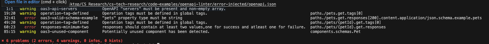

# Custom Rules
This example demonstrates how to create a custom rule to ensure the [responses](https://developer.mozilla.org/en-US/docs/Web/HTTP/Status) field in an OpenAPI specification contains at least two values—one for success and at least one for failure. The default [spectral:oas](https://docs.stoplight.io/docs/spectral/4dec24461f3af-open-api-rules) ruleset is extended, and a new custom rule is defined.

## Rule
```yaml
extends: ["spectral:oas"]

rules:
  responses-minimum-two:
    description: The responses field should contain at least two values.
    message: "{{property}} should contain at least two values, one for success and at least one for failure."
    severity: error
    given: $.paths[*].get.responses
    then:
      function: length
      functionOptions:
        min: 2

```
## Explanation
- extends: ["spectral:oas"]: Extends the default OpenAPI ruleset from Spectral.
- rules: Defines custom rules.
    - responses-minimum-two: Name of the custom rule.
    - description: A description of the rule.
    - message: Message displayed when the rule is violated.
    - severity: Severity of the rule violation, set to error.
    - given: JSONPath expression targeting the responses field of the get operation in all paths.
    - then: Applies the length function to ensure the array has at least 2 elements.

For more information on custom rules, refer to the [Spectral documentation](https://docs.stoplight.io/docs/spectral/d3482ff0ccae9-rules)

## How to use
1. Place the rule definition in the .spectral.yaml file.
2. Run Spectral to lint the OpenAPI specification. If the responses field for any get operation does not contain at least two values, an error will be triggered.

## Output


This customization ensures that the responses field adheres to the defined validation criteria for success and failure values.